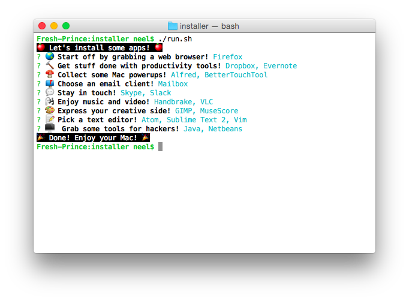

# Interactive Mac Installer (alpha)

Got a new Mac? Install 40+ of your favorite apps and tools at a tap with this interactive script.



## Running

`cd` into the cloned directory, then:

```
chmod +x run.sh
./run.sh
```

Then follow the interactive prompts to choose which programs to install!

## Todos

* Use brew cask list to hide the apps you've already installed (to make this idempotent)
* Install brew and node stuff too
* Refactor so that each installer only returns WHAT to install and doesn't actually install it -- have all installation be done at the very end. It gets laggy if you have to wait around for installations all the time.

## How it works

This uses [Cask](http://caskroom.io/) and [Homebrew](http://brew.sh) to install apps from the command line.

## Contributing

Feel free to make a pull request adding more apps from Cask or other features that a new Mac might appreciate.

## About

Made with <3 in Mountain View, CA, mostly because I felt like it.
